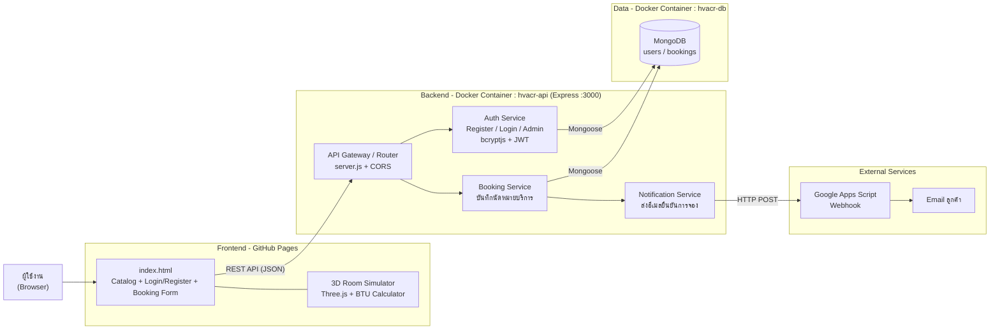
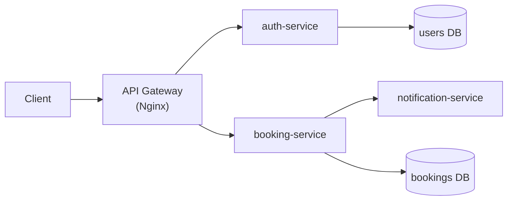
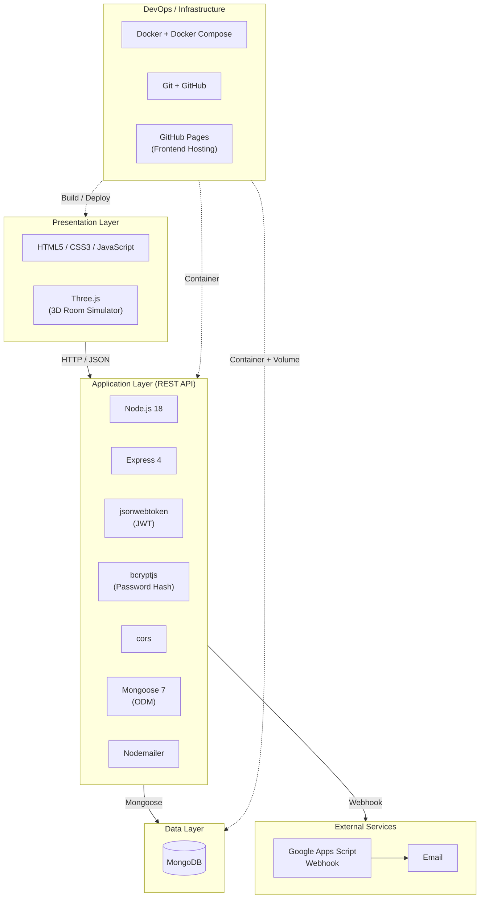

# AERIS – Architecture

เอกสารนี้ประกอบด้วย 2 ส่วนตามที่อาจารย์กำหนด
1. Microservices Architecture
2. Technology Stack Diagram

> Diagram เขียนด้วย Mermaid — GitHub จะแสดงผลเป็นรูปให้อัตโนมัติเมื่อเปิดไฟล์นี้

---

## 1. Microservices Architecture

### รายละเอียดแต่ละ Service

| Service | หน้าที่ | เทคโนโลยี | ข้อมูลที่เกี่ยวข้อง |
|---|---|---|---|
| Frontend | หน้าเว็บ, แคตตาล็อกสินค้า, จำลองห้อง 3D, คำนวณ BTU | HTML/CSS/JS, Three.js | – |
| API Gateway / Router | รับ request จาก Frontend และส่งต่อไปยัง service ที่เกี่ยวข้อง | Express, CORS | – |
| Auth Service | สมัครสมาชิก, เข้าสู่ระบบ (ลูกค้า/Admin), ออก JWT | bcryptjs, jsonwebtoken | `users` |
| Booking Service | รับและบันทึกการนัดหมาย ติดตั้ง/ล้าง/ซ่อมแอร์ | Express, Mongoose | `bookings` |
| Notification Service | ส่งอีเมลยืนยันการจอง | Google Apps Script Webhook (Nodemailer) | – |
| Database | เก็บข้อมูลผู้ใช้และการจอง | MongoDB (Docker volume `mongo-data`) | – |

### สถานะปัจจุบัน vs. เป้าหมาย

- **ปัจจุบัน**: Auth, Booking และ Notification ถูกรวมอยู่ใน Express app เดียว (`server.js`) รันเป็น 1 container (`api`) คู่กับ MongoDB (`db`) ผ่าน `docker-compose`
- **เป้าหมาย (ขั้นถัดไป)**: แยกแต่ละ service เป็น container ของตัวเอง โดยมี API Gateway (เช่น Nginx) อยู่ด้านหน้า

---

## 2. Technology Stack Diagram

### สรุป Stack

| Layer | Technology |
|---|---|
| Frontend | HTML, CSS, JavaScript, Three.js |
| Backend | Node.js 18, Express 4 |
| Security | bcryptjs, JWT (jsonwebtoken), CORS |
| Database | MongoDB + Mongoose 7 |
| Email | Google Apps Script Webhook, Nodemailer |
| DevOps | Docker, Docker Compose, Git/GitHub, GitHub Pages |
